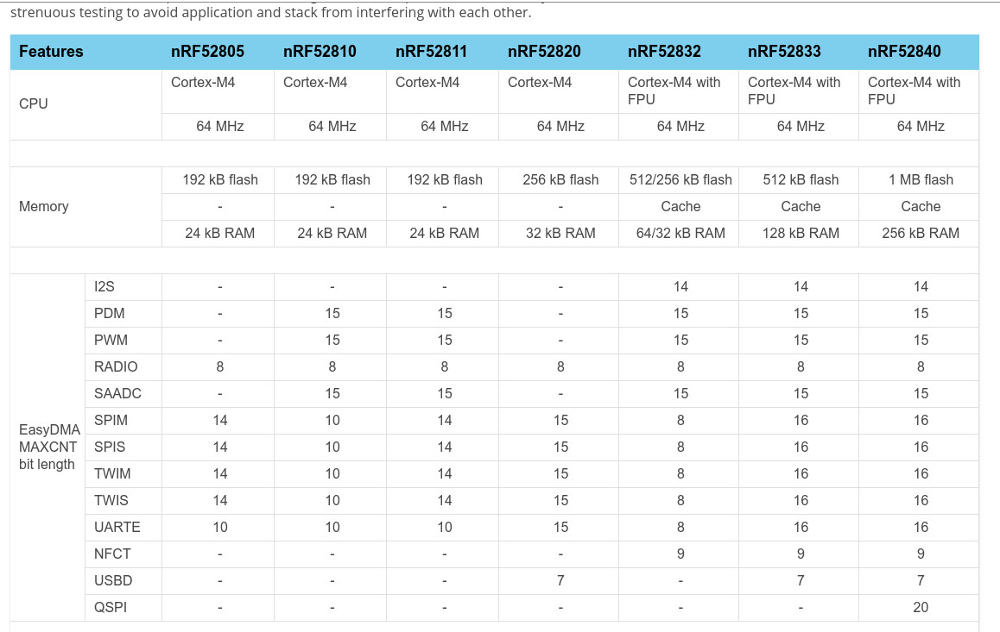
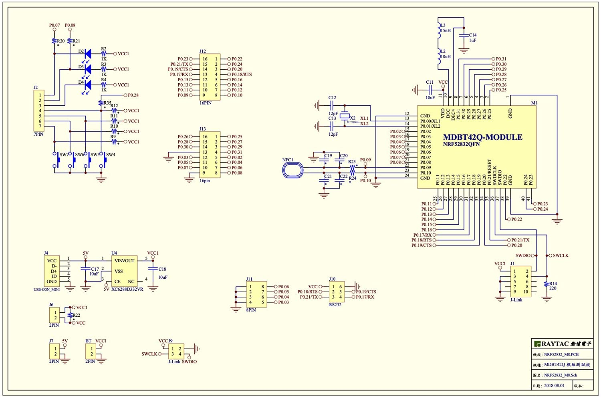

# Raytac MDBT42Q-512K NRF52532-QFAA
64KB SRAM, 512KB Flash

## nRF SOC tables  
  


## schematic


# [Pin Table in Google Drive](https://docs.google.com/spreadsheets/d/1KI1-Sdwg8mKBKlwe9-FFnI9zSHUAqnk3nffo3poKnkU/edit)

# Debug and Trace


# Memory Map


# AHB multilayer
BUS masters use **"multilayer interconnect matrix"** to access bus slaves.
* BUS Master: The **CPU** and all of the **EasyDMAs** are AHB bus masters on the AHB multilayer
* BUS Slaves: The **RAM** and various other modules are AHB slaves.


# AHB Bus Master Priority


# nRF52832 EasyDMA
* Some peripherals gain direct
access to Data RAM by EasyDMA.
* The EasyDMA is an AHB **bus master** similar to the CPU.
* The EasyDMA is connected to the AHB multilayer interconnect for direct access to the Data RAM. 
* The EasyDMA is **not** able to access the **Flash**.
* A peripheral can implement **multiple EasyDMA instances** at the same time.
  * a dedicated first channel for reading data from RAM into the peripheral at the same time as
  * a dedicated second channel for writing data to the RAM from the peripheral.  


# EasyDMA Read/Write
## Type 1
1. Address of read and write buffers are assigned to DMA controller.
2. Size of read and write buffers are assigned to DMA controller.
```.c
READERBUFFER_SIZE 5
WRITERBUFFER_SIZE 6
uint8_t readerBuffer[READERBUFFER_SIZE]
uint8_t writerBuffer[WRITERBUFFER_SIZE]
__at__ 0x20000000;
__at__ 0x20000005;
// Configuring the READER channel
MYPERIPHERAL->READER.MAXCNT = READERBUFFER_SIZE;
MYPERIPHERAL->READER.PTR = &readerBuffer;
// Configure the WRITER channel
MYPERIPHERAL->WRITER.MAXCNT = WRITEERBUFFER_SIZE;
MYPERIPHERAL->WRITER.PTR = &writerBuffer;
```


## Type 2: EasyDMA array list

* This data structure includes only a buffer with size equal to READER.MAXCNT. 
* EasyDMA will use the READER.MAXCNT register to determine when the buffer is full.
* This array list does not provide a mechanism to explicitly specify where the next item in the list is located.
* It assumes that the list is organized as a linear array where items are located **one after the other** in RAM.
```.c
#define BUFFER_SIZE 4
typedef struct ArrayList{
    uint8_t buffer[BUFFER_SIZE];
} ArrayList_type;
ArrayList_type ReaderList[3];
READER.MAXCNT = BUFFER_SIZE;
READER.PTR = &ReaderList
```
# Clock Control


# 13 FICR — Factory information configuration registers
Factory information configuration registers (FICR) are pre-programmed in factory and cannot be erased by
the user. These registers contain chip-specific information and configuration.

# Peripheral Bus


# GPIO


## 21 GPIOTE — GPIO tasks and events
* The GPIO tasks and events (GPIOTE) module provides functionality for accessing GPIO pins.
* Each GPIOTE channel can be assigned to one pin.
* A GPIOTE block enables GPIOs to generate events(interrupts) on pin state change which can be used to carry out tasks through the PPI system. 
* A GPIO can also be driven to change state on system events using the PPI system.
* Low power detection of pin state changes is possible when in System ON or System OFF.
* Total Number of GPIOTE channels are 8.
* Up to three tasks can be used in each GPIOTE channel for performing write operations to a pin.
  * Two tasks are fixed (SET and CLR), 
  * and one (OUT) is configurable to perform following operations:
    * Set
    * Clear
    * Toggle  
  * An event(interrupt) can be generated in each GPIOTE channel from one of the following input conditions:
    * Rising edge
    * Falling edge
    * Any change

21.1 Pin events and tasks
The GPIOTE module has a number of tasks and events that can be configured to operate on individual
GPIO pins.
The tasks (SET[n], CLR[n] and OUT[n]) can be used for writing to individual pins, and the events (IN[n]) can
be generated from changes occurring at the inputs of individual pins.
The SET task will set the pin selected in CONFIG[n].PSEL to high.
The CLR task will set the pin low.
The effect of the OUT task on the pin is configurable in CONFIG[n].POLARITY , and can either set the pin
high, set it low, or toggle it.
The tasks and events are configured using the CONFIG[n] registers. Every set of SET, CLR and OUT[n]
tasks and IN[n] events has one CONFIG[n] register associated with it.
As long as a SET[n], CLR[n] and OUT[n] task or an IN[n] event is configured to control a pin n, the pin's
output value will only be updated by the GPIOTE module. The pin's output value as specified in the GPIO will
therefore be ignored as long as the pin is controlled by GPIOTE. Attempting to write a pin as a normal GPIO
pin will have no effect. When the GPIOTE is disconnected from a pin, see MODE field in CONFIG[n] register,
the associated pin will get the output and configuration values specified in the GPIO module.
When conflicting tasks are triggered simultaneously (i.e. during the same clock cycle) in one channel, the
precedence of the tasks will be as described in Table 32: Task priorities on page 157.
Table 32: Task priorities
Priority
1
2
3
Task
OUT
CLR
SET
Page 15721 GPIOTE — GPIO tasks and events
When setting the CONFIG[n] registers, MODE=Disabled does not have the same effect as MODE=Task and
POLARITY=None. In the latter case, a CLR or SET task occurring at the exact same time as OUT will end
up with no change on the pin, according to the priorities described in the table above.
When a GPIOTE channel is configured to operate on a pin as a task, the initial value of that pin is configured
in the OUTINIT field of CONFIG[n].

# TWI I2C


* A typical TWI setup consists of one master and one or more slaves.
* This TWIM is only able to operate as a
single master on the TWI bus.


# SAADC
