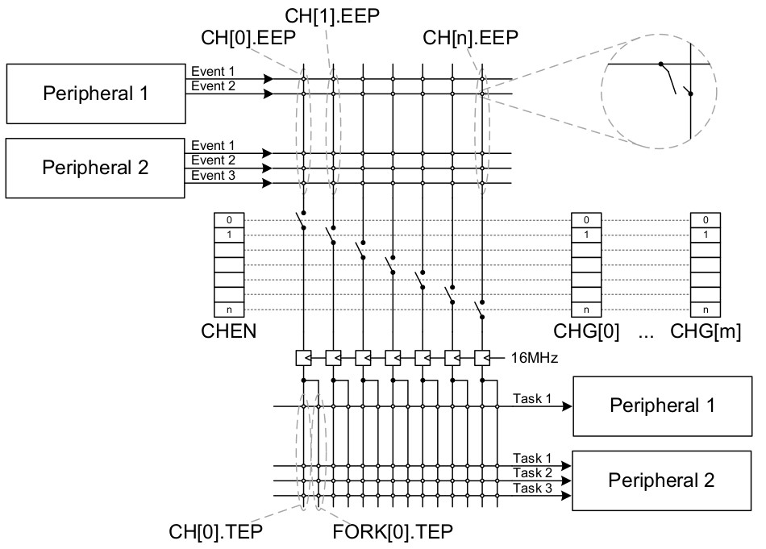

# Raytac MDBT42Q-512K NRF52532-QFAA
64KB SRAM, 512KB Flash

## nRF SOC tables  
  


## schematic


# [Pin Table in Google Drive](https://docs.google.com/spreadsheets/d/1KI1-Sdwg8mKBKlwe9-FFnI9zSHUAqnk3nffo3poKnkU/edit)

# Debug and Trace


# Memory Map


# AHB multilayer
BUS masters use **"multilayer interconnect matrix"** to access bus slaves.
* BUS Master: The **CPU** and all of the **EasyDMAs** are AHB bus masters on the AHB multilayer
* BUS Slaves: The **RAM** and various other modules are AHB slaves.


# AHB Bus Master Priority


# nRF52832 EasyDMA
* Some peripherals gain direct
access to Data RAM by EasyDMA.
* The EasyDMA is an AHB **bus master** similar to the CPU.
* The EasyDMA is connected to the AHB multilayer interconnect for direct access to the Data RAM. 
* The EasyDMA is **not** able to access the **Flash**.
* A peripheral can implement **multiple EasyDMA instances** at the same time.
  * a dedicated first channel for reading data from RAM into the peripheral at the same time as
  * a dedicated second channel for writing data to the RAM from the peripheral.  


# EasyDMA Read/Write
## Type 1
1. Address of read and write buffers are assigned to DMA controller.
2. Size of read and write buffers are assigned to DMA controller.
```.c
READERBUFFER_SIZE 5
WRITERBUFFER_SIZE 6
uint8_t readerBuffer[READERBUFFER_SIZE]
uint8_t writerBuffer[WRITERBUFFER_SIZE]
__at__ 0x20000000;
__at__ 0x20000005;
// Configuring the READER channel
MYPERIPHERAL->READER.MAXCNT = READERBUFFER_SIZE;
MYPERIPHERAL->READER.PTR = &readerBuffer;
// Configure the WRITER channel
MYPERIPHERAL->WRITER.MAXCNT = WRITEERBUFFER_SIZE;
MYPERIPHERAL->WRITER.PTR = &writerBuffer;
```


## Type 2: EasyDMA array list

* This data structure includes only a buffer with size equal to READER.MAXCNT. 
* EasyDMA will use the READER.MAXCNT register to determine when the buffer is full.
* This array list does not provide a mechanism to explicitly specify where the next item in the list is located.
* It assumes that the list is organized as a linear array where items are located **one after the other** in RAM.
```.c
#define BUFFER_SIZE 4
typedef struct ArrayList{
    uint8_t buffer[BUFFER_SIZE];
} ArrayList_type;
ArrayList_type ReaderList[3];
READER.MAXCNT = BUFFER_SIZE;
READER.PTR = &ReaderList
```
# Clock Control


# 13 FICR — Factory information configuration registers
Factory information configuration registers (FICR) are pre-programmed in factory and cannot be erased by
the user. These registers contain chip-specific information and configuration.

# Peripheral Bus


# GPIO


## 21. GPIOTE — GPIO tasks and events
* GPIO Tasks: registers to control GPIO pins
* GPIO Event: interrupt triggered by changes of gpio level, ie, Rising edge, Falling edge, Any change.
* The GPIO tasks and events (GPIOTE) module provides functionality for accessing GPIO pins.
* Each GPIOTE channel can be assigned to one pin.
* A GPIOTE block enables GPIOs to generate events(interrupts) on pin state change which can be used to carry out tasks through the PPI system. 
* A GPIO can also be driven to change state on system events using the PPI system.
* Low power detection of pin state changes is possible when in System ON or System OFF.
* Total Number of GPIOTE channels are 8.
* Up to three tasks can be used in each GPIOTE channel for performing write operations to a pin.
  * Two tasks are fixed (SET and CLR), 
  * and one (OUT) is configurable to perform following operations:
    * Set
    * Clear
    * Toggle  
  * An event(interrupt) can be generated in each GPIOTE channel from one of the following input conditions:
    * Rising edge
    * Falling edge
    * Any change

# 22. PPI — Programmable peripheral interconnect


* The **Programmable peripheral interconnect (PPI)** enables peripherals to interact autonomously with each other using tasks and events independent of the CPU. 
* The PPI allows precise synchronization between peripherals when real-time application constraints exist and eliminates the need for CPU activity to implement behavior which can be predefined using PPI.
* The PPI system has a set of channels where the **event end point (EEP)** and **task end points (TEP)** are fixed in hardware. 
  * These fixed channels can be individually enabled, disabled, or added to PPI channel groups in the same way as ordinary PPI channels.
* The PPI provides a mechanism to automatically trigger a task in one peripheral as a result of an event occurring in another peripheral. 
* A task is connected to an event through a PPI channel. 
* The PPI channel is composed of three end point registers, one EEP and two TEPs. 
* A peripheral task is connected to a TEP using the address of the task register associated with the task. 
* Similarly, a peripheral event is connected to an EEP using the address of the event register associated with the event.
* On each PPI channel, the signals are synchronized to the 16 MHz clock, to avoid any internal violation of setup and hold timings. 
  * As a consequence, events that are synchronous to the 16 MHz clock will be delayed by one clock period, while other asynchronous events will be delayed by up to one 16 MHz clock period.
* Some of the PPI channels are pre-programmed. These channels cannot be configured by the CPU, but can be added to groups and enabled and disabled like the general purpose PPI channels. 
  * The FORK TEP for these channels are still programmable and can be used by the application.

# TWI I2C
  

* A typical TWI setup consists of one master and one or more slaves.
* This TWIM is only able to operate as a
single master on the TWI bus.

# SAADC
