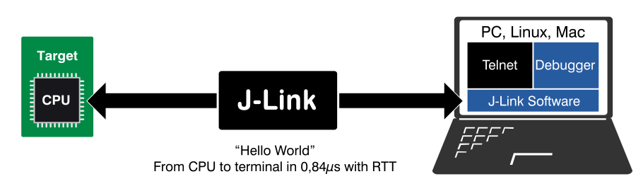

# [Real Time Transfer, RTT](https://www.segger.com/products/debug-probes/j-link/technology/about-real-time-transfer)

* Output information from the target microcontroller as well as sending input to the application at a very high speed without affecting the target's real time behavior. 
* SEGGER RTT can be used with any J-Link model and any supported target processor which allows **background memory access**, which are **Cortex-M and RX** targets.

* RTT supports multiple channels. The default implementation uses one channel per direction, which are meant for printable terminal input and output. 
* With the J-Link RTT Viewer this channel can be used for multiple "virtual" terminals, allowing to print to multiple windows (e.g. one for standard output, one for error output, one for debugging output) with just one target buffer. 
* An additional up (to host) channel can for example be used to send profiling or event tracing data.
