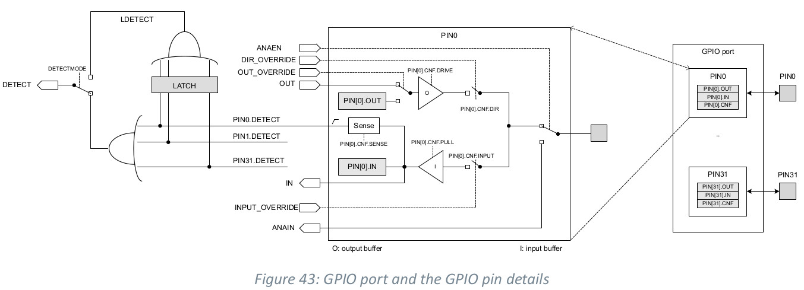
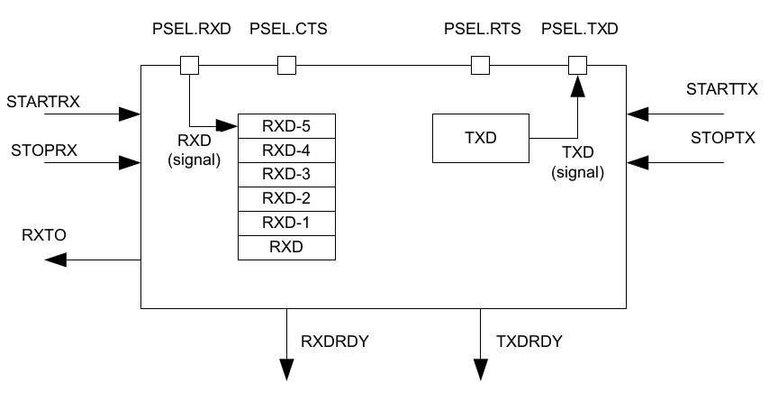
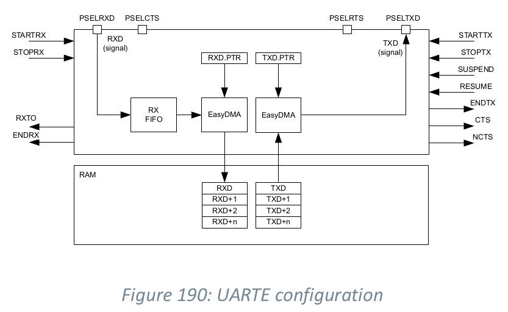
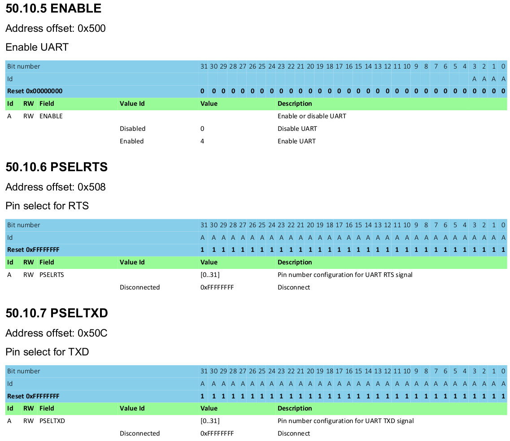
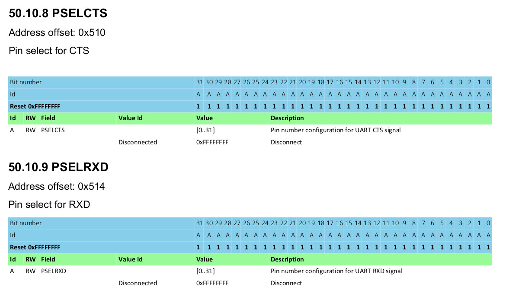
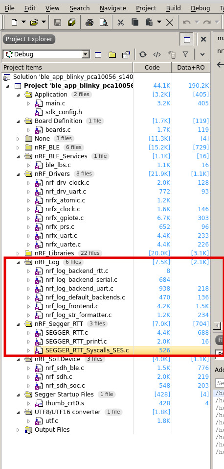

# UART config

## 1. gpio pin config


## 2. UART


### UART with EasyDMA  


## 3. How to config gpio pins to uart function pins?

  
## <span style="color:red"> Any gpio pins can be UART function pins, but gpio port0 pin 5,6,7,8 are often used for UART function pins. </span>

### 6.33.2 Pin configuration
* The different signals RXD, CTS (Clear To Send, active low), RTS (Request To Send, active low), and TXD associated with the UART are **mapped to physical UART function pins** according to the configuration specified in the
**PSEL.RXD, PSEL.CTS, PSEL.RTS, and PSEL.TXD** registers respectively.
* Setting the pin number to the above registers makes gpio pins be UART function pins.

```.c
static void uart_init(bool async_mode)
{
    nrf_drv_uart_config_t config = NRF_DRV_UART_DEFAULT_CONFIG;
    config.pseltxd  = NRF_LOG_BACKEND_UART_TX_PIN;
    config.pselrxd  = NRF_UART_PSEL_DISCONNECTED;
    config.pselcts  = NRF_UART_PSEL_DISCONNECTED;
    config.pselrts  = NRF_UART_PSEL_DISCONNECTED;
    config.baudrate = (nrf_uart_baudrate_t)NRF_LOG_BACKEND_UART_BAUDRATE;
    ret_code_t err_code = nrf_drv_uart_init(&m_uart, &config, async_mode ? uart_evt_handler : NULL);
    APP_ERROR_CHECK(err_code);

    m_async_mode = async_mode;
}
```


* If the **CONNECT** field of a PSEL.xxx register is set to **Disconnected**, the associated UART signal will **not
be connected to any physical pin**. 
* The PSEL.RXD, PSEL.CTS, PSEL.RTS, and PSEL.TXD registers and their
configurations are only used as long as the UART is enabled, and retained only for the duration the device
is in ON mode. 
* PSEL.RXD, PSEL.CTS, PSEL.RTS and PSEL.TXD must only be configured when the UART is **disabled**.
* To secure correct signal levels on the pins by the UART when the system is in OFF mode, the pins must be configured in the GPIO peripheral as described in Pin configuration on page 500.
* Only one peripheral can be assigned to drive a particular GPIO pin at a time. Failing to do so may result in
unpredictable behavior.

# UART LOG in nRF52 SDK
## with interface MCU, Segger Jlink
## UART TX/RX only without interface MCU
nRF_Log  
NRF_LOG_BACKEND_UART_ENABLED

nRF_Segger_RTT  

