# Nordic nRF SOC List  

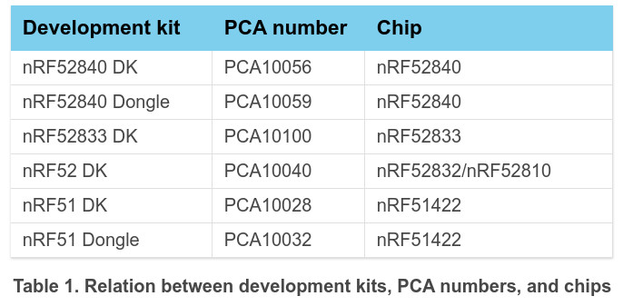

[The segger IDE, Segger Embedded Studio SES, is the only IDE tool to work for Nordic nrfxxx SDK since 2020.](
https://developer.nordicsemi.com/nRF_Connect_SDK/doc/1.3.0/nrf/gs_installing.html#installing-ses-nordic-edition)

# [1. Download Segger Embeded Studio for Nordic](https://developer.nordicsemi.com/nRF_Connect_SDK/doc/1.3.1/nrf/gs_installing.html#gs-installing)  
## [Detail](https://infocenter.nordicsemi.com/topic/ug_gsg_ses/UG/gsg/intro.html)

  

## Setup correct arm toolchain for nrf projects.
Open a project and set the toolchain path.  
$(StudioDir)/gcc/$(GCCTarget)/bin
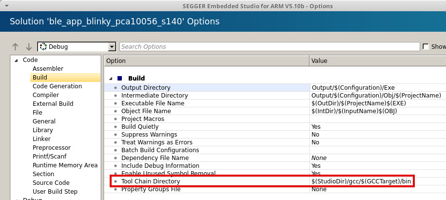

# [2. Upgrade firmware to segger j-Link OB is the first step for debug and download](https://www.segger.com/downloads/jlink/JLink_Linux_x86_64.deb)
J-Link OB is an **on-board debug probe**.
It turns an evaluation board into a complete evaluation kit!
Added features include debug support and download into Flash memory.

### [j-Link OB may need firmware update.](https://www.segger.com/downloads/jlink/#J-LinkSoftwareAndDocumentationPack)  

### After segger j-link tool is installed in your PC, "nRF Connect for Desktop" tool can automatically update firmware to segger j-link OB, so this is the first step to work for Nordic nrf board.
 
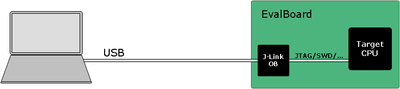

### New DevKit of nordic after Nov 2019 gets a free license to use segger IDE tool.  
### PCA10056 nRF52840-DK is NOT freely supported after Nov 2019.  

# 3. SWD/jtag debug by Segger Interface MCU
## Serial Wire Debug, SWD : 2-Pin Debug Port
* **SWDCLK, Input** : Clock signal to target CPU. It is recommended that this pin is pulled to a defined state of the target board. Shared with TMS on targets which support JTAG and SWD.
* **SWDIO, I/O** : Bi-directional data pin. This pin should be pulled up on the target. Shared with TMS on targets which support JTAG and SWD.

The interface MCU on the nRF52840 DK board runs **SEGGER J-Link OB interface** firmware and is used to
**program and debug** the firmware of the nRF52 SoC.  
  

## nrf52840 uart to segger interface MCU.
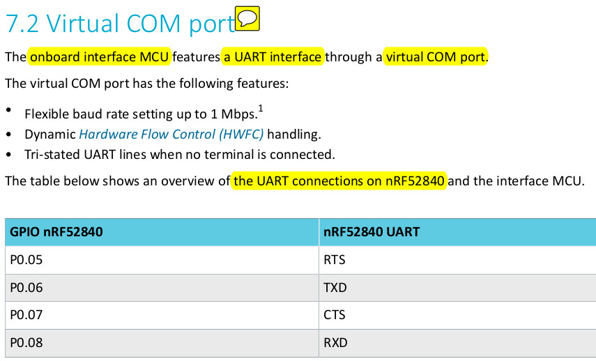
* The UART signals are **routed directly** to the interface MCU. The UART pins connected to the interface MCU
are tri-stated when no terminal is connected to the virtual COM port on the computer.
* The terminal software used must send a Data Terminal Ready (DTR) signal to configure the
UART interface MCU pins by enabling hardware flow control in terminal ap.
* The P0.05 (Request to Send (RTS)) and P0.07 (Clear to Send (CTS)) can be **used freely** when **HWFC is
disabled** on the SoC.
* To ensure that the UART lines are not affected by the interface MCU, the solder bridges for these signals
can be cut and later resoldered if needed. This might be necessary if UART without HWFC is needed while
P0.05 (RTS) and P0.07 (CTS) are used for other purposes.

## Debug nRF52840DK, pca10056 by onboard segger interface mcu.

### SWD debug pins definition of PCA10056

## Debug an external board by pca10056 debug port  
The pca10056 DK board supports **programming and debugging external boards** with nRF51 or nRF52 SoCs.

### MDBT42Q-DB (MDBT42Q-512K, nRF52832)
  

To debug an external board with SEGGER J-Link OB IF, connect to the **Debug out connector (P19)** with a **10-pin cable**. **Red side** is pin1.

  
When the **external board is powered**, the **interface MCU, segger OB IF** will **detect** the supply voltage of the board and
**program/debug the target chip on the external board** instead of the onboard nRF52840 SoC.  

### MDBT42Q-DB-V1
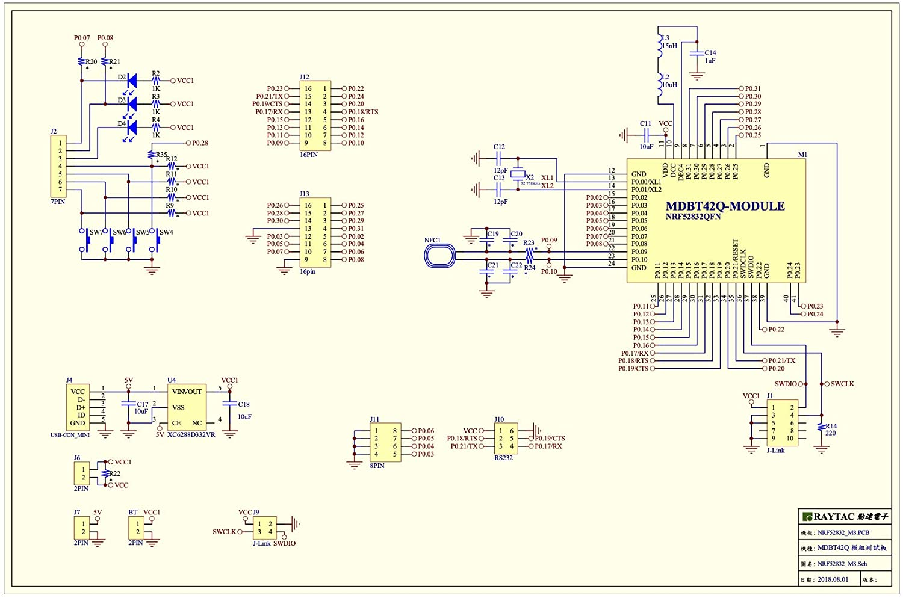  
* R2, R3, R4, R9, R10, R11, R12, R20, R21, R35 are not soldered on the DB, so they are "open/disconnected".
* pin_number of J12 and J13 : these numbers are not pin number but the port0.pin_number. 

## SWD exports a USB ttyport, ttyACM0, to output debug log.
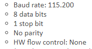  

# 4. The nordic "nRF5 SDK" and nRF helper Tool Installation
## [*4.1. The first step is to install "nRF Connect for Desktop"](https://developer.nordicsemi.com/nRF_Connect_SDK/doc/latest/nrf/gs_assistant.html#gs-assistant)  

## [4.2. Install "Getting Started Assistant" from "nRF Connect for Desktop"](https://developer.nordicsemi.com/nRF_Connect_SDK/doc/latest/nrf/gs_assistant.html#getting-started-assistant)
It assists you to install and setup the other tools and environment.

## [4.3. Download nRF5 SDK](https://www.nordicsemi.com/Software-and-tools/Software/nRF5-SDK/Download#infotabs)  
nRF5 SDK is a **mature SDK** that has been specifically written for nRF5 devices and has been used **successfully for many years**.  

* The nRF Connect SDK is where you begin building low power wireless applications with Nordic Semiconductor nRF52, nRF53, and nRF91 Series devices.
* The SDK contains optimized cellular IoT (LTE-M and NB-IoT), Bluetooth Low Energy, Thread, Zigbee, and Bluetooth Mesh stacks, a range of applications, samples, and reference implementations, as well as a full suite of drivers for Nordic Semiconductor’s devices. 

## [SoftDevice](https://www.nordicsemi.com/Software-and-tools/Software/nRF5-SDK) Bluetooth LE & ANT
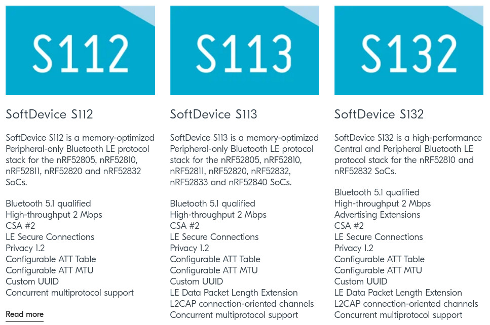
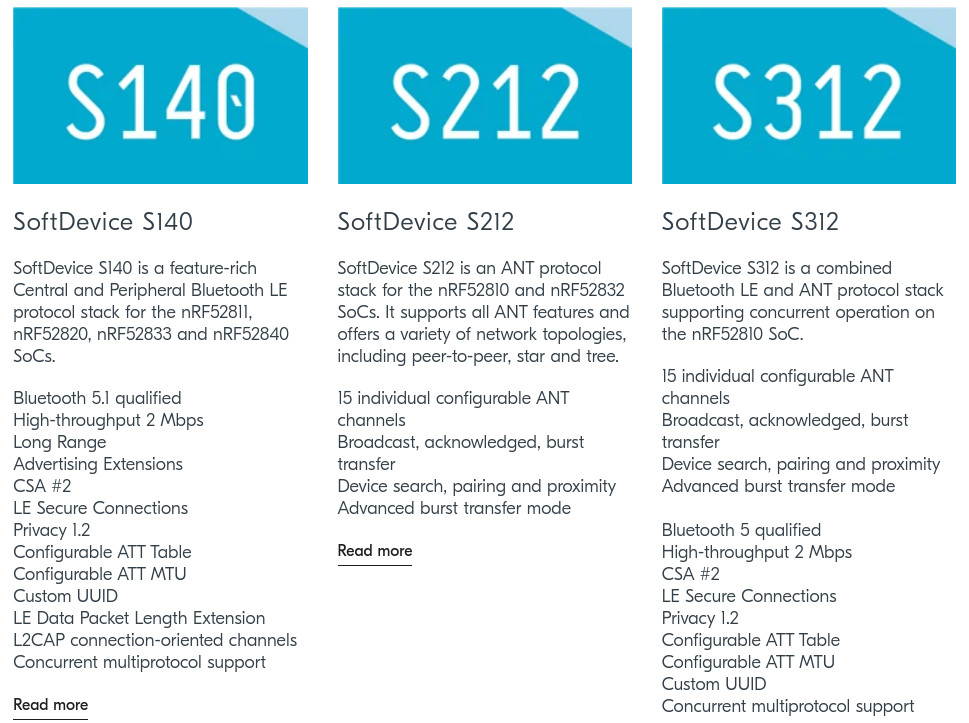
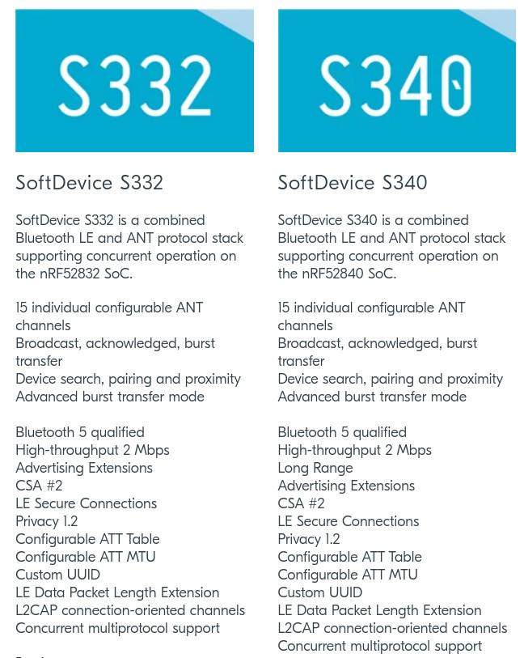

## nrfx : nrfx is a standalone set of drivers for peripherals present in Nordic Semiconductor's SoCs.
The intention was to provide drivers that can be used in various environments without the necessity to integrate other parts of the SDK into them. nrfx uses the same set of peripheral drivers in various environments, from RTOSes to bare metal applications. Hence, for a given host environment, a light integration layer must be provided that implements certain specific routines, like interrupt management, critical sections, assertions, or logging. This is done by filling a predefined set of macros with proper implementations (or keeping some empty if desired) in files named:  
nrfx_glue.h  
nrfx_log.h  
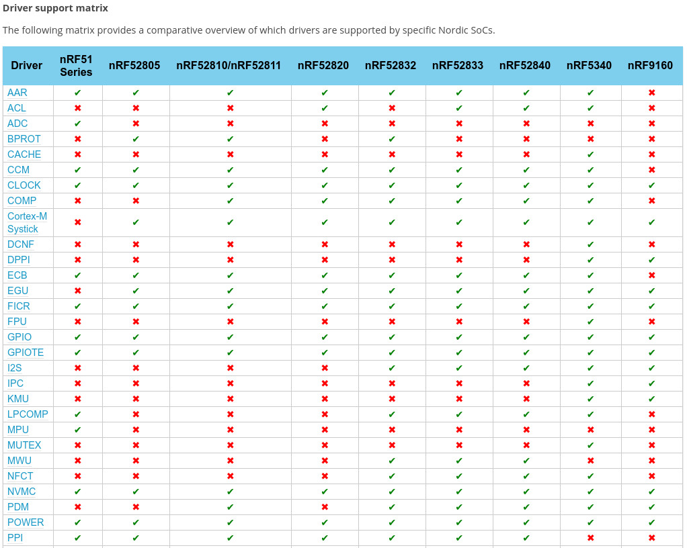
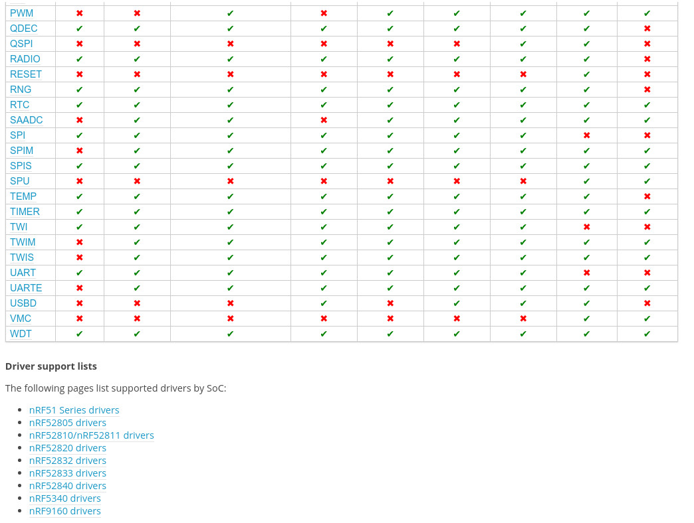

## 4.4. Open an example of nRF SDK in SES 

### build for PCA10056, nrf52840.
   * SES: File->Open solution-> browse to /path/sdk/examples/peripheral/blinky/pca10056/blank/ses/blinky_pca10056.emProject
   * open blinky_pca10056.emProject
   * build the solution.
   * Target-> Download blinky_pca10056

### build for PCA10040, nRF52832.  
MDBT42Q-DB can use pca10040 board as a base to develop.

# 5. Zephyr RTOS, nRF Connect SDK, for nRF52 and nordic SOCs
* **nRF Connect SDK** and **nRF5 SDK** are **completely different**. 
* The similarity is that **both use nrfx** as a basis for low-level peripheral drivers (but have their own higher level driver API's on top). **Other than that they are completely different**.  
* **Most importantly nRF5 SDK is a mature SDK that has been specifically written for nRF5 devices and has been used successfully for many years.**  
* **nRF Connect SDK** on the other hand is based on the **Zephyr project**. It is actively being worked on, but is **not yet ready for product development**.
* Also, note that Zephyr is not just an RTOS kernel. It is a large system consisting of many libraries, so you can almost think of it as an SDK in itself.
* nRF Connect SDK is **[best for IOT devices](https://blog.nordicsemi.com/getconnected/what-is-rtos-real-time-operating-systems-for-embedded-developers)**, because it supports **versatile communication protocols** and **low power environment**.

# 6 [Start a new project using "nRF SDK" in SES](https://www.antalife.com/2019/07/update-solar-powered-weather-station-3.html)
Set up a completely new nRF52 projects in SES is not so simple, your best bet is to copy and modify an example project that resembles what you want to achieve. [example1](https://www.novelbits.io/smart-ble-lightbulb-application-nrf52/) and [example 2](https://devzone.nordicsemi.com/f/nordic-q-a/30122/starting-clean-nrf52-embedded-c-segger-embedded-studio-project/129641#129641)

# 7. FreeRTOS
/path/to/nrfSDK/examples/ble_peripheral/ble_app_hrs_freertos

# 8. Program Guide for nRF52 SOC.
## [Application Note](app-notes/README.md)