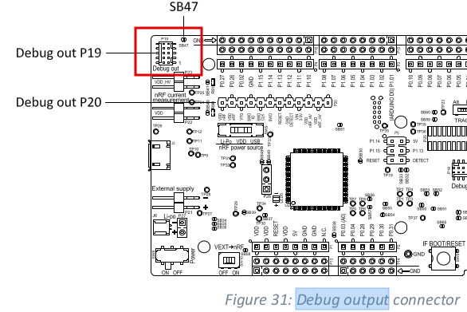

# Nordic nRF SOC List  

[The segger IDE, Segger Embedded Studio SES, is the only IDE tool to work for Nordic nrfxxx SDK since 2020.](
https://developer.nordicsemi.com/nRF_Connect_SDK/doc/1.3.0/nrf/gs_installing.html#installing-ses-nordic-edition)  
# [1. Download Segger Embeded Studio for Nordic](https://developer.nordicsemi.com/nRF_Connect_SDK/doc/1.3.0/nrf/gs_installing.html#gs-installing)  
This is a special segger embeded studio,SES, for nordic.
**V4.30a is revised by nordic socs**.  

  

# [2. Upgrade firmware to segger j-Link is the first step for debug and download](https://www.segger.com/downloads/jlink/JLink_Linux_x86_64.deb)

### [j-Link is an old debug device, so it needs firmware update.](https://www.segger.com/downloads/jlink/#J-LinkSoftwareAndDocumentationPack)  

### New DevKit of nordic after Nov 2019 gets a free license to use segger IDE tool.  
### PCA10056 nRF52840-DK is NOT freely supported after Nov 2019.  

### After segger j-link tool is installed in your PC, "nRF Connect for Desktop" tool can automatically update firmware to segger j-link, so this is the first step to work for Nordic nrf board.

## debug nRF52840DK, pca10056

## Debug an external board by nRF DK's debug port

### SWD debug pins definition

# 3. The nordic "nRF5 SDK" and nRF helper Tool Installation
## [*3.1. The first step is to install "nRF Connect for Desktop"](https://developer.nordicsemi.com/nRF_Connect_SDK/doc/latest/nrf/gs_assistant.html#gs-assistant)  

## [3.2. Install "Getting Started Assistant" from "nRF Connect for Desktop"](https://developer.nordicsemi.com/nRF_Connect_SDK/doc/latest/nrf/gs_assistant.html#getting-started-assistant)
It assists you to install and setup the other tools and environment.

## [3.3. Download nRF5 SDK](https://www.nordicsemi.com/Software-and-tools/Software/nRF5-SDK/Download#infotabs)  
nRF5 SDK is a **mature SDK** that has been specifically written for nRF5 devices and has been used **successfully for many years**.

* The nRF Connect SDK is where you begin building low power wireless applications with Nordic Semiconductor nRF52, nRF53, and nRF91 Series devices.
* The SDK contains optimized cellular IoT (LTE-M and NB-IoT), Bluetooth Low Energy, Thread, Zigbee, and Bluetooth Mesh stacks, a range of applications, samples, and reference implementations, as well as a full suite of drivers for Nordic Semiconductor’s devices. 

## 3.4. Open an example of nRF SDK in SES to build it for PCA10056, nrf52840.
   * SES: File->Open solution-> browse to /path/sdk/examples/peripheral/blinky/pca10056/blank/ses/blinky_pca10056.emProject
   * open blinky_pca10056.emProject
   * build the solution.
   * Target-> Download blinky_pca10056

# 4. Zephyr RTOS, nRF Connect SDK, for nRF52 and nordic SOCs
* **nRF Connect SDK** and **nRF5 SDK** are **completely different**. 
* The similarity is that **both use nrfx** as a basis for low-level peripheral drivers (but have their own higher level driver API's on top). **Other than that they are completely different**.  
* **Most importantly nRF5 SDK is a mature SDK that has been specifically written for nRF5 devices and has been used successfully for many years.**  
* **nRF Connect SDK** on the other hand is based on the **Zephyr project**. It is actively being worked on, but is **not yet ready for product development**.
* Also, note that Zephyr is not just an RTOS kernel. It is a large system consisting of many libraries, so you can almost think of it as an SDK in itself.
* nRF Connect SDK is **[best for IOT devices](https://blog.nordicsemi.com/getconnected/what-is-rtos-real-time-operating-systems-for-embedded-developers)**, because it supports **versatile communication protocols** and **low power environment**.

# 5 [Start a new project using "nRF SDK" in SES](https://www.antalife.com/2019/07/update-solar-powered-weather-station-3.html)
Set up a completely new nRF52 projects in SES is not so simple, your best bet is to copy and modify an example project that resembles what you want to achieve. [example1](https://www.novelbits.io/smart-ble-lightbulb-application-nrf52/) and [example 2](https://devzone.nordicsemi.com/f/nordic-q-a/30122/starting-clean-nrf52-embedded-c-segger-embedded-studio-project/129641#129641)