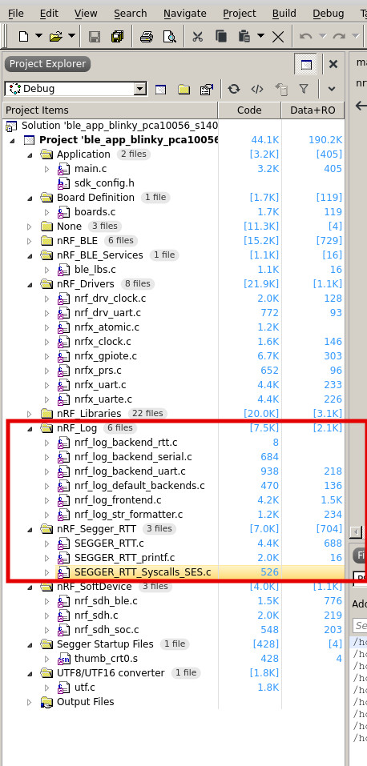

# [nRF UART/RTT Logging](https://jimmywongiot.com/2020/02/24/print-log-flash-log-crash-log-on-nordic-nrf5-sdk/) 
[nRF Logger module](https://infocenter.nordicsemi.com/index.jsp?topic=%2Fsdk_nrf5_v16.0.0%2Flib_nrf_log.html)  
### Logger backends: nRF provides multiple logger interfaces called Logger backends. 
* **RTT, UART, console** (Command Line Interface), **Flash** logger backend.

## [1. What is RTT Logging?](./0.RTT.md)
**RTT, Real Time Transfer (RTT)** is a proprietary technology for bidirectional communication that supports **J-Link** devices and ARM-based microcontrollers.   
## <span style="color:red">The advantage of using RTT is that it is very **efficient**; logging only **updates a buffer in RAM**.</span> 
* RTT does not rely on any other peripherals than the **J-Link debugging interface, SWD**.

## [2. What is UART Logging?](./0.UART.md)
* UART used to be the **default way** of outputting information in most SDK examples. 
* It is **quick and power-efficient**, but it **requires dedicated use of the UART peripheral** for logging.  

**Raw UART:**
Unlike UART, raw UART uses **blocking calls**. Therefore, it works in all situations, while **regular UART stops working if interrupts are turned off** (on purpose or because of a failure). Raw UART is **slower and less power-efficient** than regular UART.

## 3. The nRF Logging Library
The nRF logging library provides functions to output logging information over **[SEGGER's Real Time Transfer (RTT)](./0.RTT.md), [UART, or raw UART](./0.UART.md)**. The library can be used both to output messages and to read input.

## <span style="color:red">You can decide if you want to output the logging information over RTT, UART, or raw UART, or if you do not want to output it at all.</span>

## Config file, sdk_config.h, for the project: /path/to/sdk/examples/peripheral/bsp/pca10056/blank/config/sdk_config.h


* To enable **logging over RTT**, define **NRF_LOG_BACKEND_RTT_ENABLED=1** in the project. 
```
//==========================================================
// <e> NRF_LOG_BACKEND_RTT_ENABLED - nrf_log_backend_rtt - Log RTT backend
//==========================================================
#ifndef NRF_LOG_BACKEND_RTT_ENABLED
#define NRF_LOG_BACKEND_RTT_ENABLED 1
#endif
```

* To enable **logging over UART**, define NRF_LOG_BACKEND_UART_ENABLED=1. 

```
 <e> NRF_LOG_BACKEND_UART_ENABLED - nrf_log_backend_uart - Log UART backend
//==========================================================
#ifndef NRF_LOG_BACKEND_UART_ENABLED
#define NRF_LOG_BACKEND_UART_ENABLED 1
#endif
// <o> NRF_LOG_BACKEND_UART_TX_PIN - UART TX pin 
#ifndef NRF_LOG_BACKEND_UART_TX_PIN
#define NRF_LOG_BACKEND_UART_TX_PIN 6
#endif
```

* To **disable logging, do not specify either one**.
* If you choose to not output any information, all logging macros can be left in the code without any cost;they will just be ignored. 


nRF_Segger_RTT  



## 4. Logger Modules
### [UART](./0.UART.md)
### [RTT](./0.RTT.md)